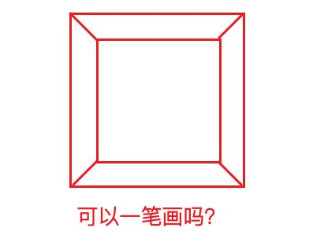
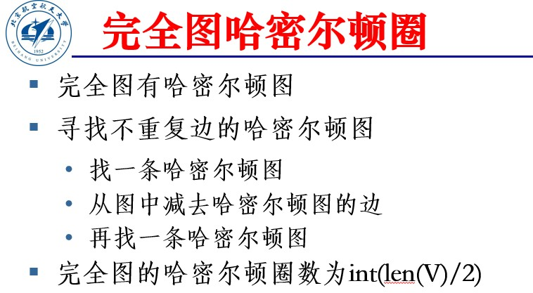

# 穿程问题

## 欧拉图

### 定义

欧拉图从七桥问题衍生而来，解决的是**不重复走所有边**的问题。

欧拉通路：设$G＝<V,E>$是**连通**无向图，经过G中**每条边**一次且仅一次的**非闭合链**称为欧拉链（通路）。

欧拉圈：经过G中**每条边**一次且仅一次的**闭合链**称为欧拉圈。

欧拉图：具有欧拉圈的图称为欧拉图。

### 定理

设G是无向连通图，则如下三个命题等价

1. G是欧拉图
2. G中**所有顶点的度数是偶数**
3. G是若干不重边圈的并

定理：无向图G为欧拉图，当且仅当G**是连通图**，并且G的每一个顶点都是偶顶点。

## 欧拉通路

定理：无向图G中有连接ui和uj的欧拉通路，当且仅当G是连通图，并且G中只有ui和uj是奇顶点。

证明：

其实我也不太懂，大概原理就是欧拉图作为圈的并，可以一圈圈地走完所有边再回到原点，那么拿掉其中的一条边，就可以实现从这条边的一端出发，走完所有边，然后到另一端的效果。

解决了一笔画问题。

如下图的“回”字，因为找不到两个度数为奇数的点，所以没法一笔画完。



## 哈密顿图

### 定义

哈密顿圈：无向图G中穿过每个顶点一次且仅一次的圈，称为哈密顿圈。

哈密顿链：无向图G中穿过每个顶点一次且仅一次的非闭合链，称为哈密顿链。

哈密顿通路：有向图D中穿过每个顶点一次且仅一次的非闭合通路，称为哈密顿通路。

哈密顿图：具有哈密顿圈的图称为哈密顿图。

### 定理

设G是具有n个顶点的连通无向图。若G中每一对顶点的次数之和大于或等于n-1，则G中存在一条哈密顿链。

> 满足此条件，可以完成图的哈密顿周游。

若G中每一对顶点的次数之和大于或等于n，则G中存在一条哈密顿圈。

### 算法

程序tourpath0算法：

利用邻接表中靠前的点，走尽可能的远。

1. 取路径path的末尾顶点`path[-1]`为w；
2. 取顶点w的邻接表E2；
3. 若邻接表E2中顶点u不在path上，则u加入path，否则，返回。

程序tourpath1算法：

末尾点走不下去了，据末尾点在倒数第二个点邻接表中的index，换后面的点再走。

1. 取路径path的末尾顶点`v=path.pop()`为v；
2. 若 path非空，取路径path的末尾顶点path[-1]为u；
3. 从顶点u的邻接表从**顶点v以后**依次检查`k=E2.index(v)`；
4. 若v=E2[k]不在path，则v为path的新末尾顶点，直至邻接表结束；
5. 若path有新顶点，则结束，否则，path弹出末尾顶点。

程序tourpath算法：

1. 若`len(path) == m`，则求新的周游通路，即tourpath1(V,E,path,m)。
2. 若`len(path) != 0`，依次迭代执行tourpath0与tourpath1。

```python
def tourpath(V,E,path,m):
    if(len(path) == m):
        path=tourpath1(V,E,path,m)
    while(len(path) != 0):
        path=tourpath0(V,E,path,m)
        if(len(path) == m):
            break
        path=tourpath1(V,E,path,m)
return path 

def Hamiltonpath(V,E,v0):
    global Ea,paths

    V=sorted(V)
    Ea=adjacentlist(V,E)
    paths=set({})
    path=[v0]
    m=len(V)
    path=tourpath(V,Ea,path,m)
    paths=paths|{tuple(path)}
    while(len(path) == m):
        path=tourpath(V,Ea,path,m)
        if len(path)==m:
            paths=paths|{tuple(path)}
            print(path)
    return paths 
```

## 杂



我很想知道这张PPT想表达什么。

记一下结论

完全图的哈密尔顿圈数为`int(len(V)/2)`

