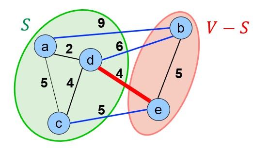

# 树

## 参考资料

[霍夫曼树-rfhits的笔记](https://github.com/rfhits/Data-Structure-BUAA/blob/main/1-Notes/3-%E6%A0%91/4-%E8%B5%AB%E5%A4%AB%E6%9B%BC%E6%A0%91.md)

## 树的概念

### 定义

设$G=<V,E>$是无向图，若$G$**连通且无圈**，则称为树，记为$G=<V, E>$。

### 定理

#### 存在基本链

设T是树，则在T的任何两个不同的顶点之间存在**唯一**的一条基本链。若在T的两个不相邻的顶点之间加上一条边e，则图T+e仅有一个圈。

证明：

因为T是连通的，所以ui和uj之间必然存在一条基本链$\alpha $，假设$u_i$和$u_j$之间存在另外一条基本链$\beta$，则$\alpha \cap \beta$必包含圈。

#### 点数=边数+1

设树T是一个(n, m)图，则m = n - 1 。

证明：归纳法证明即可

#### 至少两点度数=1

在非平凡树T中至少存在两个次数为1的顶点。

证明:

设T是(n, m)树，顶点集合$V= \{u_1,u_2,...,u_n\}$，则$\sum_{i=1}^{n} d(u_i) = 2m = 2(n -1)$

如果每个顶点的次数$d(u_i) \geq 2$，则有$\sum_{i=1}^{n} d(u_i) \geq 2n$

如果**仅有一个**顶点$d(u)= 1$，则有$\sum_{i=1}^{n} d(u_i) \geq 2n-1$

均可导出矛盾

#### 等价定义

设T是非平凡 ( n, m ) 无向图，则下面五个命题是等价的。

1. T 是树；
2. T 连通且无圈；
3. T的每一对顶点之间有唯一的一条基本链；
4. T连通且m = n–1；
5. T无圈且m = n–1。

证明：

任意顶点之间有唯一基本链→连通且无圈

有基本链，则连通;唯一基本链，则无圈;

连通且m = n-1→连通且无圈

假设有p个顶点构成的圈，则圈的边数q=p,其他(n-p)个顶点至少需要n一p个边保证连通，则边的数量m≥q+n -p = n，与(m =n -1)矛盾

无圈且m = n-1→连通且无圈

假设不连通，可以拆成l个无圈且连通的分支，则$m = \sum_{i=1}^{l}m_i = \sum_{i=1}^{l}(n_i-1) = n-l<n-1$，导出矛盾

## 霍夫曼编码

二元**前缀**码：用0-1字符串作为代码表示字符，要求任何字符的代码都不能作为其他字符代码的前缀

前缀的意思是，我这个字符对应的编码**不是**任何其他字符编码的前缀。

### 步骤

权值最小的节点，表示用的最少的节点，那么我们就要把它放地离根节点尽可能的远。所以我们先选择权值小的节点，从底部构建一棵二叉树。

1. 假设顶点集合为S，$u_1$和$u_2$。是权值最低的两个顶点;
2. 构造一个新的顶点w，令$w$的左侧子节点为$u_1$，右侧子节点为$u_2$，权值为$u_1$和$u_2$之和;
3. $S \leftarrow ( S- \{u1,u2\}) \cup \{w\}$，返回步骤1，直至$|S| =1$

## 最小生成树

英文为Minimum Spanning Tree。

### 定义

生成树：如果无向图 G 的一个**生成子图** T 是树，则称 T 是图 G 的一个生成树。

最小生成树：对于一个带权无向连通图，最小生成树是其生成树中边的权重之和最小的那个。

### 应用

1. Network design （电话线、电子电路设计、有线电视、路网设计、计算机网络）
2. NP难问题的近似求解（多旅行商规划、Steiner tree ）
3. 图片分割、图片特征
4. 聚类分析（层次聚类）

需要注意的是：最小生成树可能不唯一。

### 想法

安全边（SafeEdge）定义：对于边的集合A⊆T，其中T是一颗MST。如果集合A∪{(u,v)}同样属于T，则(u,v)是集合A的安全边。

分割（Cut）：(S,V-S)是图 G(V,E)的一个划分，划分之后，一部分结点∈S，其他结点∈{V-S}。

分割是针对点集而言的。

横跨（Cross）：如果边(u,v)∈E的一个端点在集合S中，另一端点在集合(V-S)中，则称边(u,v)是分割横跨边。de横跨了上述分割。

尊重（Respect）：如果集合A中不存在横跨该分割的边，则称该分割尊重集合A 。集合A非常的识相，没有动这个分割。

**轻边**（Light edge）：在横跨一个分割的所有边中，权重最小的边，称为轻边

### 定理

1. 对于带权无向连通图 $G(V,E,W)$；
2. 假设边的集合𝐴为一棵MST的子集；
3. $(S,V−S)$为任意尊重𝐴的分割；
4. $(u,v)$是横跨分割$(S,V−S)$的**轻边**；

那么，边(𝑢,𝑣)是𝐴的一条安全边。

也就是说，我们要找的安全边，就是当前这个分划对应的轻边。

证明：

大概思路是，轻边的权重是最小的，如果不选择轻边而选择“绕道而行”去连接$V-A$集合中的对应那个元素，将会导致生成树的权重变大。

为了保证生成树是最小生成树，所以选择轻边。

### 算法

Prim算法中，集合A是一棵树，每次加入到A中的安全边都是连结A和**A之外的某个结点**的边中**权重最小**的边，也就是把轻边加进去。

1. 任选一个结点𝑟，得到集合 $S = \{r\}$和$A = \emptyset$；
2. 找到**横跨**分割$(S,V-S)$**轻边**，将其加入到$A$ ，并将其$(V-S$中的顶点加入到集合$S$；
3. 如果(𝑉−𝑆)=∅，则输出MST(𝑆, 𝐴)，否则，回到2。

Kruskal算法中，集合A是森林，每次搜索都是找到连结两颗树的权重最小的边。

Prim算法可以看到是从一个点，慢慢连接轻边，然后变成了树

Kruskal是一直挑选边，这边挑了那边挑，然后从森林（好几棵树）变成了一棵树。
