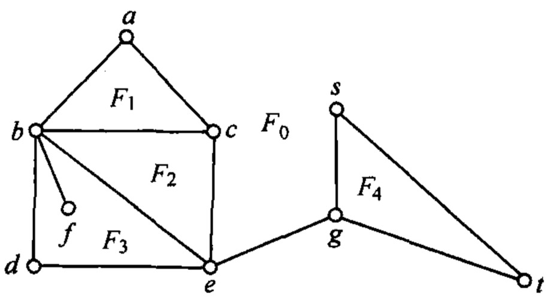
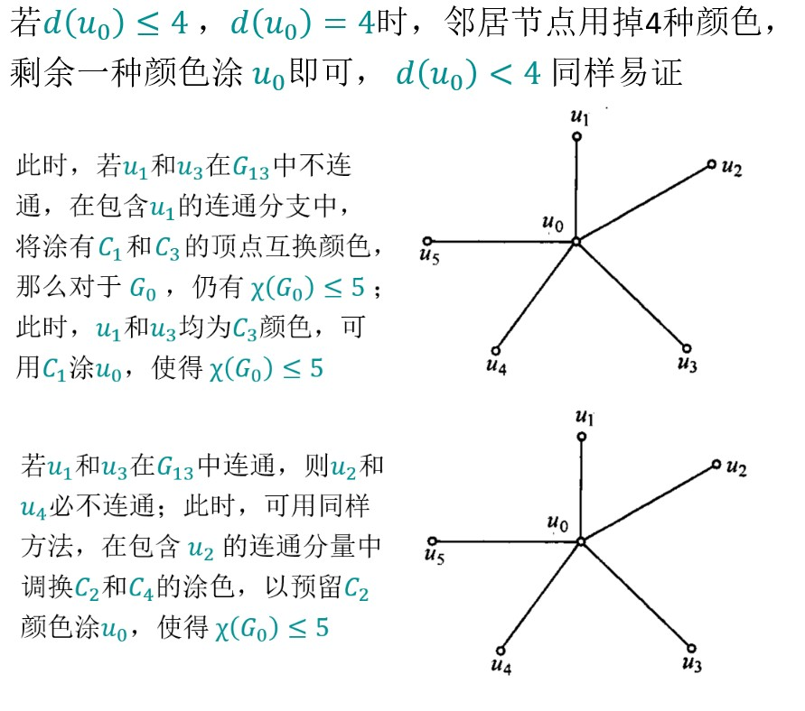

# 平面图

## 概念

### 定义

若能将一个无向图$G$画在平面上：$G$的边在顶点之外没有任何交叉，则称$G$为平面图；否则称$G$为非平面图。

### 非平面图

边数最少的非平面图：$K_{3,3}$

点数最少的非平面图：$K_5$

然而，$K_{3,3}$和$K_5$删除任意一条边就是平面图，实在是太巧了。

### 平面图的面及其周界

当把一个连通平面图 G 画在平面上，使它的边在顶点之外没有任何交叉时，G 的边把平面分割成许多区域，这样的一个区域成为图 G 的面。

平面图的面又分为有限面和无限面

* 无限面是平面图外部的无限区域，如 $F_0$；
* 有限面是平面图内部的各个有限区域，如$F_1$,$F_2$,$F_3$,$F_4$；

周界：围成一个面的各边构成的闭合链，称为**周界**。

* F_1 的周界是(a,b,c,a)；
* F_2 的周界是(b,c,e,b)；
* F_3 的周界是(b,e,d,b,f,b)，其中悬挂边(b,f)  会出现2次；
* F_0 的周界是(a,b,d,e,g,t,s,g,e,c,a)，其中桥边(e,g)也会出现2次；

直观地说，如果看到一个边“落在”了面“里面”，那么，它就会在周界里出现两次。

一个平面图的所有面的**次数之和**等于边的数量的两倍。注意是次数。

面的次数就是一个面的周界有几条边（桥边计数两次）。

## 欧拉公式

对于具有 k 个面的(n,m)连通平面图G，等式（称为欧拉公式）恒成立： n−m+k=2

证明：利用归纳法，将边数为m的图去掉一个边，再补回这条边，看看影响。

> 𝑚=0 时，为孤立顶点，等式成立；
> 假设对于边数为 𝑚−1 的连通平面图，等式均成立
> 若图 𝐺 中存在次数为 1 的顶点记为 u，其所在悬挂边为(u,𝑣)，删除该边和顶点 u 得到 (𝑛^′,𝑚^′ ) 的图 𝐺^′。由于图 𝐺^′ 的边数 𝑚^′=𝑚−1，由假设可知 𝑛^′−𝑚^′+𝑘^′=2 ⇒(𝑛^′+1)−(𝑚^′+1)+𝑘^′=2 ⇒ 𝑛−𝑚+𝑘=2
>
>
> 图 𝐺中不存在次数为 1 的顶点，则图 𝐺 中必有环，必定有有限面。在某一有限面的周界上任意去掉一条圈上的边(u,𝑣)，得到新图 𝐺^′，其边数为 𝑚^′=𝑚−1，由假设可知 𝑛^′−𝑚^′+𝑘^′=2  ⇒ 𝑛^′−(𝑚^′+1)+(𝑘^′+1)=2  ⇒ 𝑛−𝑚+𝑘=2（ 𝐺与 𝐺^′相比，顶点数不变，边数和面数均+1）

## 极大平面图

### 定义

设图 𝐺 是一个平面图，如果连接 𝐺 的任意两个不邻接顶点 u 和 𝑣，都会使 𝐺+(u,𝑣) 变成非平面图，则称图 𝐺 是极大平面图。

### 定理

设G 是具有至少三个顶点的极大平面图，则 G 的**任何一个面**都是$K_3$。

> 也就是说，任意一个面都是三角形。

证明：

假设不是$K_3$，我们导出矛盾。

用反证法证明。设图 𝐺中至少有一个面不是K_3，设其周界的四条边为(u_1,u_2,u_3,u_4,u_1 )
如果 u_1与u_3不邻接，因圈(u_1,u_2,u_3,u_4,u_1 )围成一有限面，将u_1与u_3相连并不破坏图的平面性，导出矛盾
如果 u_1与u_3不邻接，因圈(u_1,u_2,u_3,u_4,u_1 )围成一有限面，根据类似上一条的讨论， u_2与u_4不能不邻接
如果u_1与u_3邻接，且u_2与u_4邻接，必有交叉，与平面图假设矛盾

### 极大平面图的欧拉公式

必要条件

若一个图是极大平面图，则 m=3n-6

$n-m+k = 2, 3k=2m\Rightarrow m = 3n - 6$

由此我们得到了一个必要条件（确实是必要条件，$K_{3,3}$可推翻充分性）

若一个图是极大平面图，则 $m=3n-6$

若一个图是**平面图**，则$m \leq 3n-6$，尚可加边。

### K33和K5非平面图的证明

若K5是平面图，则$m\leq 3n-6$，but$n(K_5) = 5, m(K_5) = 10, 10 \leq 15-6=9$，导出矛盾。

对于K33，因为我们可以画出一个和K33点数、边数一样多的平面图，所以只利用点和边数量的性质是无法证明它是非平面图，所以还需要利用它**二分图**的性质。

二分图每个圈都是偶数，所有K33圈的长度大于等于4

$n-m+k = 2, 4k \leq 2m \Rightarrow m\leq 2n -4$

$n(K_{3,3}) = 6, m(K_{3,3} = 9) \Rightarrow 9 \leq 12-4 = 8$，矛盾。

### 平面图的充分必要条件

图 𝐺是平面图，当且仅当它不包含同胚于$K_{3,3}$或$K_5$的子图。

## 着色问题

对给定无向图G的顶点进行涂色，如果每个顶点只涂一种颜色并且任何两个邻接的顶点颜色不同，则称为图的一个正常着色。正常着色所需要的最少的颜色数，称为图 G的着色数，记为 $\chi(G)$。

注意，着色没有要求是不是平面图，就算是非平面图，也可以着色。

比如完全图$K_n$着色数为$n$，因为要做到接连的点不同色。

### 韦尔奇-鲍威尔算法

1. 将图 G 的顶点按**次数递减**的顺序排序；
2. 用一种颜色涂染序列中的第一个顶点，以及与该顶点**不相邻**的每一个顶点；
3. 余下的节点重新排序，按上述方法重新涂色。

### 五色定理

题外话：因为四色定理的存在，平面图着色数一定是小于4的。

首先，总有点的度数小于6。因为平面图$m \leq 3n -6$，若所有点的度数大于等于6，有$6n \leq 2m$，导出矛盾$6n \leq 6n -12$。

归纳：

假设n-1点的平面图成立，五色可涂完。

对于n个点的平面图，抹掉度数最高的点，再添加回来。

如果这个点的度数为5，

可证明总有两点不连通，可使其同色，在一者的连通分支中交换颜色，那么度数为5的点，周围只有4种颜色。

